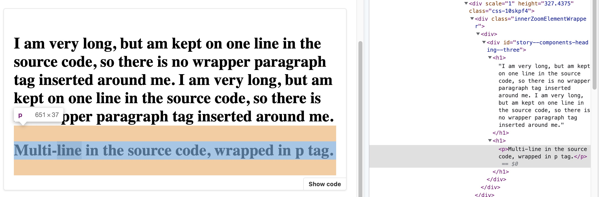

# mdx2-rendering-bugs-reproduction

Reproduction of some rendering bugs I've encountered with MDX 2 in Storybook.

`yarn install` then `yarn storybook` to run the reproduction Storybook.

[View the story source](https://github.com/melanieseltzer/mdx2-rendering-bugs-reproduction/blob/main/stories/Heading.stories.mdx?plain=1).

